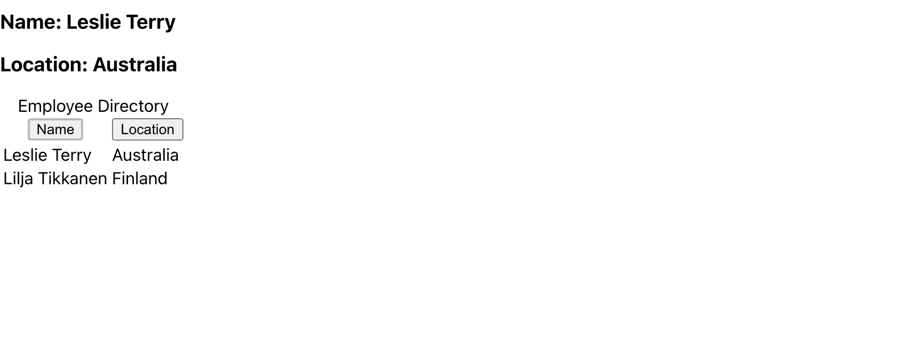

## Description

This app uses react to sort and create a list of employees using the random person generator api. 

# Table of Contents 

1. [Description](#Description)
 2. [Questions](#Questions?) 

 3. [Installation](#Installation) 

 4. [Usage](#Usage) 

 5. [Contributing](#Contributing) 

6. [License](#License) 

 7. [Tests](#Tests)

## Screenshot

## Usage

## Contributing

## Questions?

Contact me here:

[GitHub Profile](https://www.github.com/mokulling)

[Email](mailto:mokulling@gmail.com)

 Reach out to me at either of the links above if you have any questions regarding the project or if you want to become a collaborator.

## License
CC

## Tests